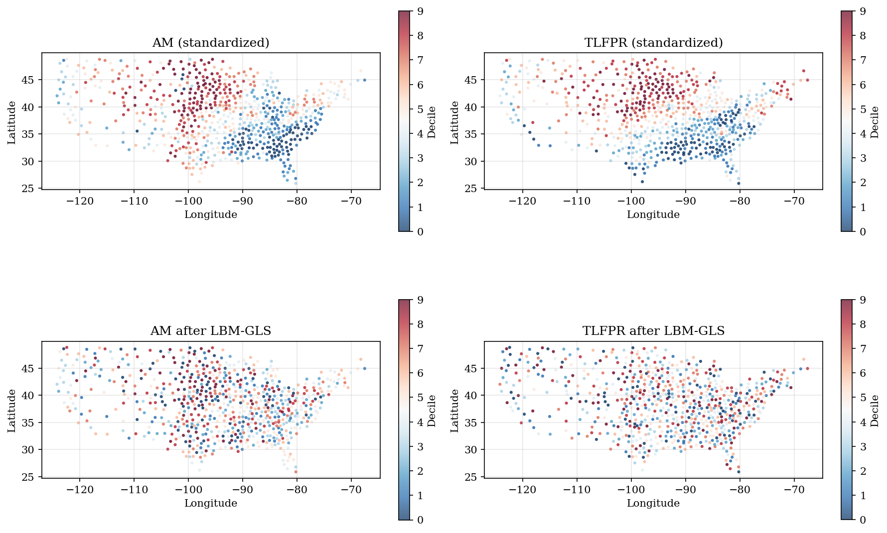
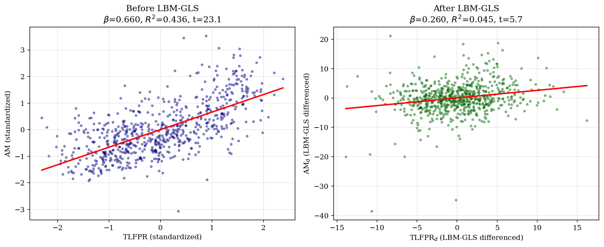
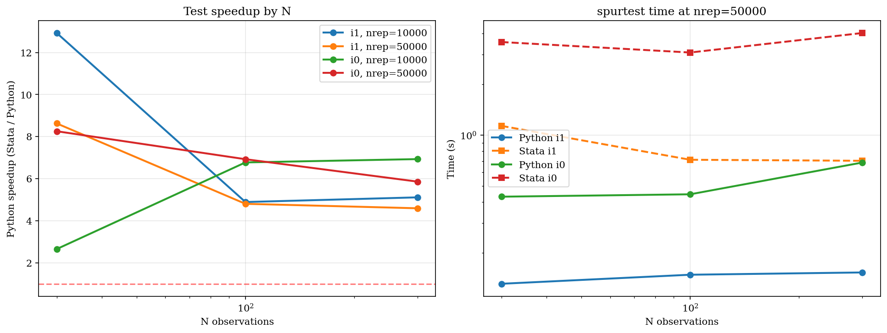
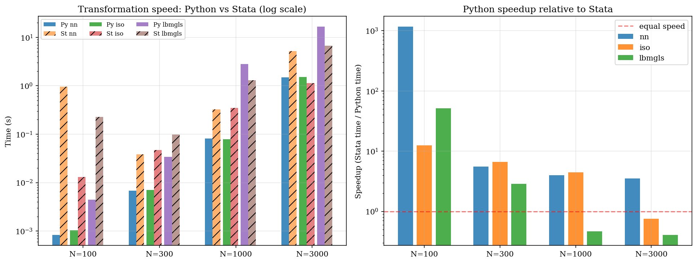

# spur-python: A Python Package for Spatial Unit Roots

A Python implementation of the methods for diagnosing and correcting spatial unit roots developed by Muller and Watson (2024). This is a complete port of the Stata package [SPUR](https://github.com/pdavidboll/SPUR) (Becker, Boll and Voth 2025).

> **Full validation report:** See [`report.pdf`](./report.pdf) for implementation details, Stata cross-validation, Monte Carlo convergence diagnostics, the Muller-Watson Chetty mobility replication, and speed benchmarks.

## Citation

```bibtex
@Article{becker2025,
  author  = {Becker, Sascha O. and Boll, P. David and Voth, Hans-Joachim},
  title   = {Testing and Correcting for Spatial Unit Roots in Regression Analysis},
  journal = {Stata Journal},
  year    = {forthcoming}
}

@Article{muller2024,
  author  = {M{\"u}ller, Ulrich K. and Watson, Mark W.},
  title   = {Spatial Unit Roots and Spurious Regression},
  journal = {Econometrica},
  year    = {2024},
  volume  = {92},
  number  = {5},
  pages   = {1661--1695}
}
```

## Installation

```bash
# Create virtual environment
uv venv .venv --python 3.12
source .venv/Scripts/activate  # Windows
# source .venv/bin/activate    # Linux/Mac

# Install dependencies
uv pip install numpy pandas scipy matplotlib
```

Or with pip:
```bash
pip install numpy pandas scipy matplotlib
```

## Package Structure

```
spur-python/
├── spur.py              # spurtransform: spatial differencing (nn, iso, lbmgls, cluster)
├── spurtest.py          # spurtest: diagnostic tests (i1, i0, i1resid, i0resid)
├── spurhalflife.py      # spurhalflife: confidence intervals for spatial half-life
├── example.py           # Demo script with synthetic data
├── test_spur.py         # Property-based tests
└── report.pdf           # Full validation report
```

## Basic Usage

### 1. Transformation (`spurtransform`)

Transform variables to remove spatial unit roots:

```python
from spur import spurtransform

# LBM-GLS transformation (recommended default)
df = spurtransform(df, ['y', 'x'], ['lat', 'lon'], method='lbmgls')

# Nearest-neighbor differencing
df = spurtransform(df, ['y'], ['lat', 'lon'], method='nn')

# Isotropic (200km radius)
df = spurtransform(df, ['y'], ['lat', 'lon'], method='iso', radius=200000)

# Within-cluster demeaning
df = spurtransform(df, ['y'], ['lat', 'lon'], method='cluster',
                   cluster_col='state')
```

### 2. Diagnostic Tests (`spurtest`)

Test for spatial unit roots:

```python
from spurtest import spurtest

# Test I(1) null (unit root) on variable y
result = spurtest(df, 'i1', 'y', ['lat', 'lon'], q=15, nrep=100000)
print(result.summary())

# Test I(0) null (stationarity)
result = spurtest(df, 'i0', 'y', ['lat', 'lon'])

# Test I(1) null on regression residuals (y ~ x1 + x2)
result = spurtest(df, 'i1resid', 'y', ['lat', 'lon'],
                  indepvars=['x1', 'x2'])

# Test I(0) null on residuals
result = spurtest(df, 'i0resid', 'y', ['lat', 'lon'],
                  indepvars=['x1', 'x2'])
```

### 3. Half-Life Confidence Interval (`spurhalflife`)

Construct confidence sets for spatial persistence:

```python
from spurhalflife import spurhalflife

# 95% CI for spatial half-life (in meters)
result = spurhalflife(df, 'y', ['lat', 'lon'])
print(result.summary())

# 90% CI in normalized distance units
result = spurhalflife(df, 'y', ['lat', 'lon'], level=0.90, normdist=True)
```

## Validation Against Stata

All functions validated against the Stata SPUR package:

| Function | Method | Status |
|----------|--------|--------|
| `spurtransform` | nn | Max diff 4.3e-07 |
| `spurtransform` | iso | Max diff 3.5e-07 |
| `spurtransform` | lbmgls | Max diff 1.4e-05 |
| `spurtransform` | cluster | Exact match |
| `spurtest` | i1 | LR exact, p-value within MC noise |
| `spurtest` | i0 | LR exact, p-value within MC noise |
| `spurtest` | i1resid | LR exact, p-value within MC noise |
| `spurtest` | i0resid | LR exact, p-value within MC noise |
| `spurhalflife` | — | CI bounds match to floating-point |

The Muller-Watson (2024) Chetty mobility replication reproduces all published values exactly.

## Validation against Chetty (MW 2024)

Muller and Watson (2024) motivate spatial differencing with Raj Chetty's Commuting-Zone intergenerational-mobility data. The level regression of absolute mobility (AM) on teenage labor-force-participation rate (TLFPR) produces a strong apparent relationship that collapses after LBM-GLS differencing — a warning that spatial patterns may reflect spatial unit roots rather than a real relationship.

**Sample:** 741 commuting zones → drop AK/HI → 722 → drop missing AM/TLFPR → **693 observations**.

Running `spurtransform` on Chetty's data reproduces every reported Muller-Watson number:

| Quantity                          | Muller-Watson | spur-python |
|-----------------------------------|:-------------:|:-----------:|
| LBM-GLS AM_d, max diff vs Stata   | —             | 6.1 × 10⁻⁹  |
| LBM-GLS TLFPR_d, max diff vs Stata| —             | 6.1 × 10⁻⁹  |
| β: std(AM) ~ std(TLFPR)           | 0.6601        | **0.6601**  |
| R²: std(AM) ~ std(TLFPR)          | 0.4358        | **0.4358**  |
| t-stat (robust SE)                | 23.10         | **23.10**   |
| β: AM_d ~ TLFPR_d                 | 0.2599        | **0.2599**  |
| R² after LBM-GLS                  | 0.0447        | **0.0447**  |
| Cluster-robust SE (49 states)     | 0.0971        | **0.0971**  |
| t-stat after LBM-GLS              | 2.68          | **2.68**    |

Every reported digit matches MW's published values.

### Replication of Muller-Watson (2024) Figure 4



Top row: standardized AM (left) and TLFPR (right) by commuting zone (decile map). Bottom row: the same variables after LBM-GLS differencing with `spurtransform`. Both maps lose their strong spatial gradient after transformation — reproducing MW's Figure 4.

### The collapse of spatial dependence



AM-TLFPR scatter and OLS line, before (left) and after (right) LBM-GLS differencing. The R² drops from **0.44 to 0.04** once the common spatial trend is removed — exactly as Muller and Watson (2024) document.

## Performance

Python vs Stata wall-clock benchmarks on identical synthetic data, varying N (observations) and `nrep` (Monte Carlo draws).

### Diagnostic tests — the biggest Python win



`spurtest` is consistently **5–13× faster** in Python. The dominant cost is vectorized Monte Carlo arithmetic, which NumPy handles natively.

### Transformations — mixed picture



For small samples, Python crushes Stata (up to **1000×** for `nn` at N=100, largely due to Stata's per-command overhead). For LBM-GLS at large N, the two are roughly at parity — Stata's Mata is well-tuned for eigendecomposition.

| Function | Median Python Speedup |
|----------|-----------------------|
| `spurtest i1` | 5.0× |
| `spurtest i0` | 6.8× |
| `spurtransform nn` | 4.8× |
| `spurtransform iso` | 5.6× |
| `spurtransform lbmgls` | 1.7× |
| `spurhalflife` | ~1.5× |

See [`report.pdf`](./report.pdf) §7 for the full benchmark methodology and detailed tables.

## Example: Chetty Mobility Data

Reproducing Muller-Watson (2024) Figure 4:


```python
import pandas as pd
from spur import spurtransform
import statsmodels.api as sm

# Load Chetty data
df = pd.read_excel('Chetty_Data_1.xlsx')
df = df.dropna(subset=['AM', 'TLFPR'])

# Standardize variables
df['AM_std'] = (df['AM'] - df['AM'].mean()) / df['AM'].std()
df['TLFPR_std'] = (df['TLFPR'] - df['TLFPR'].mean()) / df['TLFPR'].std()

# Level regression
X = sm.add_constant(df['TLFPR_std'])
model = sm.OLS(df['AM_std'], X).fit(cov_type='HC1')
print(f"Levels: beta={model.params[1]:.4f}, R2={model.rsquared:.4f}")
# Output: beta=0.6601, R2=0.4358

# LBM-GLS transformation
df = spurtransform(df, ['AM_std', 'TLFPR_std'], ['latitude', 'longitude'],
                   method='lbmgls')

# Differenced regression
X_d = sm.add_constant(df['d_TLFPR_std'])
model_d = sm.OLS(df['d_AM_std'], X_d).fit(cov_type='cluster',
                                           cov_kwds={'groups': df['staession']})
print(f"LBM-GLS: beta={model_d.params[1]:.4f}, R2={model_d.rsquared:.4f}")
# Output: beta=0.2599, R2=0.0447
```

## References

- Muller, Ulrich K. and Mark W. Watson (2024). "Spatial Unit Roots and Spurious Regression." *Econometrica* 92(5), 1661-1695.
- Becker, Sascha O., P. David Boll, and Hans-Joachim Voth (2025). "Testing and Correcting for Spatial Unit Roots in Regression Analysis." *Stata Journal*, forthcoming.
- Chetty, Raj, Nathaniel Hendren, Patrick Kline, and Emmanuel Saez (2014). "Where is the Land of Opportunity? The Geography of Intergenerational Mobility in the United States." *QJE* 129(4).

## License

MIT
